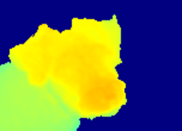
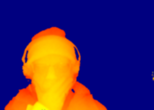
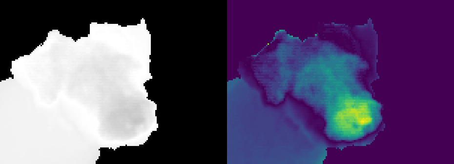

<div align="justify">

In my endless quest to make things I like, with budgets next to zero, often recylcing perfectly functional retro-tech, I have been meaning to put out a tutorial on how to hook a kinect one with a Raspberry Pi. Specifically a Pi 4, or a Pi400, to have a portable system to scan objects, or to gesture control apps for demos and outreach activities. 

Well, with several years of delay, I have finally done so! I publishes a gorgeous [Hackster project](https://www.hackster.io/kupkasmale/super-cheap-3d-scanner-camera-controller-b1ff81) for anybody interested in such a thing to have it up and running in no time! 

The applications of the Kinect sensors can be quite fun, as one has access to video, IR, depth sensors as well as a microphone, all in one package! Some of the ideas that occurred to me are a 3d webcam, a "Minority Report" style of remote controller, and perhaps the easiest and more humble, a 3d scanner. Which is exactly what I used as the motivation in the Hackster post. 

However, in that blog I mostly focus on how to read the data and use Open-CV to get nice depth pictures like the ones below:
</div>

<div style="text-align: center">

    
    
    

<b><i>Images taken with the kinect depth sensor: A hand, Captain the dog, and myself.</i></b>
</div>


However the tutorial does not discuss the final piece of the puzzle, which is to generate a 3d mesh representation of the data, like ones embedded below. To achieve this I used [PyVista](https://pyvista.org/) and [Open CV](https://opencv.org/).

<p align = "center">
<iframe  src="
https://calugo.github.io/Kinect-OCV/hand.html" style="border: 5px dotted black; width: 100%; height: 300px;"> </iframe>
<b><i>
Interactive 3d rendering of the hand depth scan. The right-clicked mouse allows to  rotate the mesh. Use the middle scroll wheel to zoom in/out.
</i></b>
<iframe  src="
https://calugo.github.io/Kinect-OCV/handm.html" style="border: 5px dotted black; width: 100%; height: 300px;"> </iframe>
<b><i>
Wired 3d rendering of the hand depth scan. Move the right-clicked mouse to rotate. Use the middle scroll wheel to zoom in/out.
</i></b>
</p>

<div style = "text-align: justify">
To turn the images into 3d meshes, the steps are pretty simple! The main steps are shown below:
</div>

First: Import the libraries required
```
import skimage.io as io 
import matplotlib.pyplot as plt
import numpy as np
import pyvista as pv
import pandas as pd
from pyvista import examples
from skimage.color import rgb2gray
import glob as glob
import cv2
```

Second: Load the image file as an array, turn it into a scalar image type.

```
file= 'carlos.png'
Z = io.imread(file)
z = rgb2gray(Z)
```
Third, generate a grid array with the data, and the PyVista does the mesh magic!

```
Ia = 140*z 

#The value of 140 is an arbitrary scalar to sharpen small details
x, y = np.mgrid[0:Ia.shape[0], 0:Ia.shape[1]]

#standard mesh and colored mesh with the elevation value
grid = pv.StructuredGrid(x, y , Ia, force_float=False)
grid_tub = grid.elevation()
```
It is possible to generate  3d plots and exported to a variety of formats. In the snippet below the plotter shows the generated mesh and to export it to an html file to embeded in a website, such as this!

```
pv.global_theme.background = 'white'
pv.global_theme.font.color = 'black'
pv.global_theme.edge_color = 'white'

pl = pv.Plotter(shape=(1, 1),off_screen=True)

pl.subplot(0, 0)
pl.add_mesh(grid_tub,lighting=False,opacity=1.0,smooth_shading=True,show_scalar_bar=False)
#l.add_mesh(grido, color='red',opacity=0.5)
pl.add_text("Raw", color='k')
pl.camera_position = (0, 0, 844.1376029929585)
pl.background_color = 'white'

pl.save_graphic("face.svg")  
pl.screenshot('face.png')

pl.show()
pl.export_html('face2x.html')
```
Running the above steps on the image of myself generates the meshes below:

<p align = "center">
<iframe  src="
https://calugo.github.io/Kinect-OCV/face2x.html" style="border: 5px dotted black; width: 100%; height: 300px;"> </iframe>
<b><i>
3d rendering of myself! Move the left-clicked mouse to rotate. Use the middle scroll wheel to zoom in/out.
</i></b>
<iframe  src="
https://calugo.github.io/Kinect-OCV/face2.html" style="border: 5px dotted black; width: 100%; height: 300px;"> </iframe>
<b><i>
Wired grid 3d rendering of myself! Move the left-clicked mouse to rotate. Use the middle scroll wheel to zoom in/out.
</i></b>
</p>

<div style = "text-align: justify">
Sometimes, it is neccesary to perform some simple operations to generate the right mesh. For example, the dog image, when plotted, it shows that the values define a concave surface, this means the dog's nose is closer to the background than the body. The surface is inside out (figure below, left).
</div>

<p align = "center">

<b><i>Left: Raw data from the kinect, it is easy to see that the nose and face details get darker, which means those values are closer to the background. Right: Corrected convexity by applying the transform described below.
</i></b>
</p>


To get the surface convexity correctly is straightforward:

```
file= 'dogo.png'
Z = io.imread(file)
zn = rgb2gray(Z)

minz = min(zn.ravel())
maxz = max(zn.ravel())

#Set the images values between zero and one
zn = (zn-minz)/(maxz-minz)

#Initialise an array with zeros 
qn = np.zeros(zn.shape)

#Get the values of the depth map and reflect them
X = zn > 0
qn[X]=1-zn[X]

#The array qn can be now 3d rendered as before!

```

<p align = "center">
<iframe  src="
https://calugo.github.io/Kinect-OCV/dogx.html" style="border: 5px dotted black; width: 100%; height: 300px;"> </iframe>
<b><i>
Dog's depth map 3d rendering! Use the left-clicked mouse to rotate it. The scroll wheel zooms in/out.
</i></b>
<iframe  src="
https://calugo.github.io/Kinect-OCV/dog.html" style="border: 5px dotted black; width: 100%; height: 300px;"> </iframe>
<b><i>
Same as above but using a wired 3d rendering. Use the left-clicked mouse to rotate it. Use the scrolling wheel to zoom in/out.
</i></b>
</p>


<p align = "justified">
Finally, another common artefact that sometimes occurs with images the values of edges, which sometimes are very sharp. This could lead to arifacts at the moment of renderon the 3d meshes.
</p>


<p align = "center">
 
<b><i>Left: Raw data from the kinect. Middle-Left: Transformed array from the inside out values. Middle-Right: Contour detected of values which are too high. Right: Final map with the contour removed, ready to be rendered. This effect of the high valued contours can also be seen in the dog's left ears.
</i></b>
</p>

To get rid of these edges, I applied two common edge detection filters, namely Canny and Laplace.

```
#This Block is the same as for my face
file= 'hand.png'
Z = io.imread(file)
zn = rgb2gray(Z)

#This block corrects the convexity
zn = (zn-minz)/(maxz-minz)
qn = np.zeros(zn.shape)

X = zn > 0
qn[X]=1-zn[X]

################
#Edge detection#
################

#This block applies a Canny filter
pn = cv2.normalize(qn, None, 0, 255, cv2.NORM_MINMAX, dtype=cv2.CV_8U)

#The parameters threshold1 and threshold 2 are adjustable
edges = cv2.Canny(pn, threshold1=10, threshold2=300)
W = edges > 0

Y = qn> 0
qmax = max(qn[Y].ravel())
Z = qn > 0.76*qmax
qn[Z]=0.0
qn[W]=0.0
pnn = cv2.normalize(qn, None, 0, 255, cv2.NORM_MINMAX, dtype=cv2.CV_8U)

# Apply Laplacian operator
laplacian = cv2.Laplacian(pnn, cv2.CV_64F)
 
#Convert to uint8
laplacian_abs = cv2.convertScaleAbs(laplacian)
#The threshol value depends on the image, adjust as needed
Q =laplacian_abs > 15
qn[Q] = 0.0
```

<p align = "justify">

The hand rendering looks similar to the one at the beginning of the post! That's it, hopefully you find this little project as fun as I did. 

The codes for getting the data from the sensor and a notebook with the steps presented here can be found in the following links:
</p>

1. The hardware Hackster project lives [here](https://www.hackster.io/kupkasmale/super-cheap-3d-scanner-camera-controller-b1ff81). 
1. The codes for the sensor operation and a notebook with the methods presented here can be found [here](https://github.com/calugo/Kinect-OCV).

See you on the next post!
