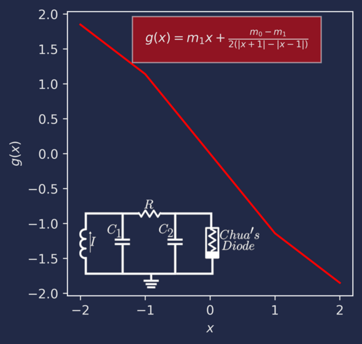
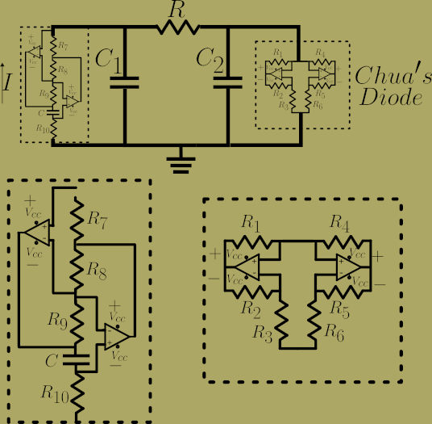
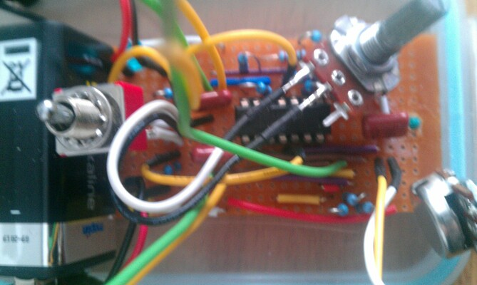
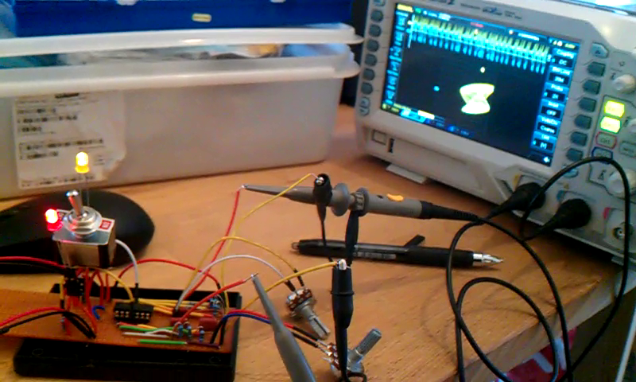
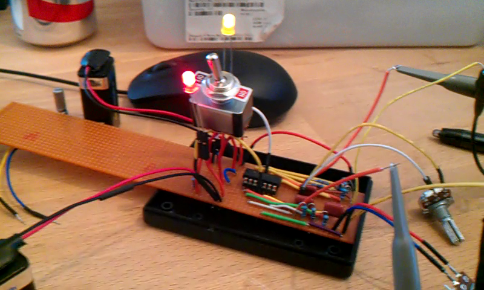
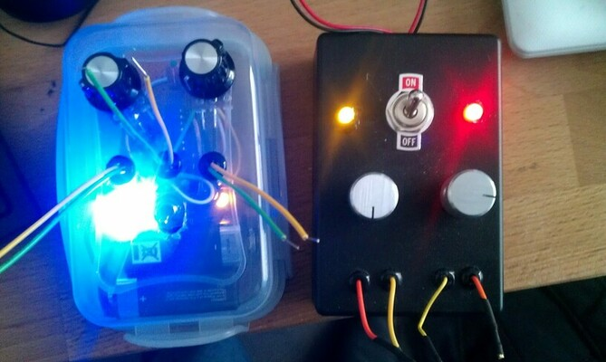

First and foremost I want to acknowledge the great Valentin Sidersky for all the information presented in the great website <a href="https://chuacircuits.com/" target="_blank">chuacircuits.com</a>. All the information regarding the construction of the circuits discussed here is an abridged version of the instructions you can find on his page. 

This is part two of the series devoted to showcasing demos made to link biology, physics, maths and experiments. the aim is basically to use these in lectures, talks and outreach activities. Also because I love doing numerics in C/C++, python and compile the codes to JavaScript to web usage with threejs. So, yes, It is all for fun!

The story of Oscillating chemical reactions such as the B-Z reaction is one of my favorite episodes in the history of science, and somewhat overlooked. Essentially, the discovery of autonomous systems which can produce spatiotemporal patterns such as waves had a profound impact in the way we understand living systems, as living processes occurring in systems such as genetic circuits or metabolic networks, were no more seen as stationary or static systems approaching equilibrium values, but dynamical out of equilibrium systems able to display rich behaviours such as chaos and spatial patterns.

Since then, research on this topic has grown exponentially and it is still a very active field of research. The ideas in this post consist of showing how the same machinery can lead to dynamics which are very different by just tuning a parameter, as well as to build a physical version of the mathematical device, again, using a very small budget. 

# Chua's system.

Consider the circuit schematics shown in the figure below. It consists of an RLC circuit, in which there is a non-linear component labeled Chua's diode. If we use the variables  \(V_1\), \(V_2\) and \(I\), for the Voltages across the capacitors \(C_1\), \(C_2\) and the current through the inductor It is easy to obtain the equations for the system:

$$ \dot{V_1}= \frac{1}{RC_1}[(V_2-V_1) -Rg(V_1)]\quad(1)$$
$$ \dot{V_2}= \frac{1}{RC_2}(V_1-V_2+RI)\quad(2)$$
$$ \dot{I}= -V_2/L\quad(3)$$

<b><i>Schematics and non-linear function \(g\) used in the Chua's oscillator. \(R\), \(L\), \(C_1\) and \(C_2\) are the resistance, inductance and capacitances values of the circuit's components. The form used to describe the non-linear response of the diode is \(g(x)=m_1x+\frac{m_0-m_1}{2(|x+1|-|x-1|)}\). Where \(m_1\) is the slope in the outer extremes of the plot, and \(m_0\) is the slope between -1 and 1.
</i></b>

Eqns. (1)-(3) are often studied by introducing the variables \\(X\\), \\(Y\\) and \\(Z\\) and parameters \\( \alpha \\) and \\( \beta\\). For the system to read as follows:

$$\dot{X} = \alpha(Y-X-g(X))\quad(4)$$
$$\dot{Y} = X - Y -Z\quad(5)$$
$$\dot{Z} = -\beta Y \quad(6)$$

The piecewise linear (i.e. non-linear) function \\(g \\) is plotted in the figure above and in this post we use the form:

$$ g(X) = m_1X+\frac{m_0-m_1}{2(|X+1|+|X-1|)}\quad(7)$$.

This RLC oscillator can be easily solved to explore the complex dynamics it can display by tuning the parameters.  If you want to check out the simulations on its own tab <a href="https://calugo.github.io/Lorenz-Chua-WASM/Chua2.html" target="_blank">click here.</a> If you are on a phone or a small screen <a href="https://calugo.github.io/Lorenz-Chua-WASM/Chua.html" target="_blank">this link</a> might work better.

Below I show an application to integrate the system. The data shown is centered, i.e, if \\(x,y,z\\) are the raw solutions and \\(\bar{x},\bar{y},\bar{x}\\) the data displayed is \\(X=x-\bar{x}\\), \\(Y=y-\bar{y}\\) and \\(Z=z-\bar{z}\\).

<iframe  src="
https://calugo.github.io/Lorenz-Chua-WASM/Chua2.html" style="border: 0px dotted black; width: 100%; height: 850px;"> </iframe>
<b><i>
Interactive simulator: The tunable parameters are M0 and M1: The slopes of the Chua diode (Eqn (7)), Xo, Yo, Zo: The initial conditions,  a and b: Which are the parameters \( \alpha \) and \(\beta\) in Eqns (4)-(6)
 The plots displayed are the phase space \( (X,Y,Z) \) as well as the temporal evolution of the solutions \( X(t), Y(t)\) and \(Z(t) \). Once a solution is computed the PLAY button shows an animation of the simulation.
</i></b>

The default values are chosen to exhibit the double scroll attractor dynamics. It is easy to obtain a single periodic attractor by deceasing \( \alpha \). The simulations alone allow to see how a fixed "phenotype" or circuit design can lead to different behaviours, depending of the underlying building blocks, using the biological analogy, the genotype, which in this case is provided by the features of the components, namely \( R, C_1, C_2, L \).

## Building the tunable circuit.

Now, the fun bit. The goal is to actually build the circuit and to be able to tune the parameters in the device in real time! To achieve this goal there are four components that are quite easy to get out of the box. The resistor \(R\), the two capacitors \(C_1\) and \(C_2\) and the inductor \(L\). The former three are actually very easy to obtain in any electronics component supplier, the inductor might need a bit of an extra effort. 

### Inductor and Chua's diode. 

Magnetic Induction in a circuit requires the generation ov a ver precise induction field using a coil around some material with a determined geometry such as a cylindrical or a torus coil. These components are not as easy to come by cheaply. Instead using a digital oscillator it is possible to build and equivalent component.  In this case the use of active components is used to build and inductor replacement called "gyrator". The equivalent inductance value is \\(L=R_7 R_9 R_{10}/R_8\\).  

<b><i>Schematics showing how to build the inductor and the diode using Operational Amplifiers and only resistors and a capacitor. The OpAms are the only powered units in the circuits. The circuit is powered by two \( 9V \) Batteries. 
</i></b>

 

It is easy to build the circuit using the gyrator configuration using only resistors and inductors, as well as the diode by using an integrated set of operational amplifiers such as the TL074CN, which comes with four units, which is what we require. Below I show some pictures of the circuits I built for my demos. I also boxed these in boxes available from any electronics vendor or even using a lunchbox (black and transparent box respectively).


I



<b><i>Schematics showing how to build the inductor and the diode using Operational Amplifiers with resistors and a capacitor. The OpAms are the only powered units in the circuits. The circuit is powered by two \( 9V \) batteries. Click on the images to enlarge them!
</i></b>

In order to have knobs to change the parameters the resistors \(R_{10} and R \) must be potentiometers. The table below shows the values of the components:

* \\( R,\\ R_{10} = 2.5\\ k\Omega\\ (Potentiometers)\\). 
* \\( R_1,\\ R_2 = 220\\ \Omega \\).
* \\( R_3 = 2.2\\ k\Omega,\\ R_4,R_5=22.0\\ k\Omega  \\).
* \\( R_6=3.3\\ k\Omega,\\ R_7=100\\ k\Omega,\\ R_8,\\ R_9=1.0\\ k\Omega \\).
* \\( C=100\\ nF,\\ C_1=10\\ nF, \\ C_2=100\\ nF\\).

# Measuring.

If we want to measure the variables \\( X,Y,Z \\) we need to add ways to measure the voltage values across \\(C_1 \\) and \\(C_2 \\) as well as across the gyrator, which is at the point between \\( R_7\\) and \\(R_8\\). To achieve this we need an oscilloscope. Below I show some movies I took using a digital oscilloscope, which costs can range from a few hundreds to even thousands of pounds, as well as using a USB oscilloscope, which can be used in a laptop, such as the (now defunct) BitScope Micro, or other very cheap handheld kits. 

 <iframe  src="gallery/chuamute.mp4" style="border: 3px dotted black; width: 100%; height: 300px;"> </iframe>
<b><i>Testing the circuit to show a transition between a periodic closed orbit to the double scroll attractor. This is using a lab-bench oscilloscope.
</i></b>

Because all these posts are made with the objective of showing how to build cheap demos. Below I show the kit I have used to in courses on dynamical systems as well as in system biology.

 <iframe  src="gallery/chuax.mp4" style="border: 3px dotted black; width: 100%; height: 300px;"> </iframe>
<b><i>Screen capture of the BitScope sensor data plotter, showing the same transition as above.
</i></b>

This type of devices, coupled with models are an excellent example to tune the behaviour with knobs in real time. In the context of evolution and development, tuning parameters using the same wiring and machinery, is a great analogy to illustrate what a mutation of a component can produce on the whole system. Which often is taken for granted during courses on systems biology. 

Finally, a brief shot of the scope and oscillator in action, to illustrate its portability. It just require a computer, the oscillator and the scope! Again, my cheap oscilloscope seems to be discontinued, and more powerful and cheaper kits are now available. So this can be made way smaller. This type of devices can also be used to carry out experiments and demos on very interesting topics, such as synchronization, and parameter estimation, as well as in Physics informed learning!

 <iframe  src="gallery/ChuaScopeM.mp4" style="border: 3px dotted black; width: 100%; height: 300px;"> </iframe>
<b><i>The sensor and  the circuit box in action. the plotter is the same as above the BitScope software.
</i></b>

Finally, as usual, Codes and instructions to integrate the Chua and Lorenz systems, as well as WASM implementations can be found in this <a href="https://github.com/calugo/Lorenz-Chua-WASM" target="_blank">repository</a>.  

For those interested in another remarkable system. Live demos of the Lorenz dynamics cam be found in the links below: 

 <a href="https://calugo.github.io/Lorenz-Chua-WASM/Lorenz2.html" target="_blank">Interactive Lorenz System Simulations.</a> 

 <a href="https://calugo.github.io/Lorenz-Chua-WASM/Lorenz.html" target="_blank">Interactive Lorenz System Simulations - Better for phone screens.</a> 

That's all for now, I hope somebody will find this type of demos useful. If so, let me know!

