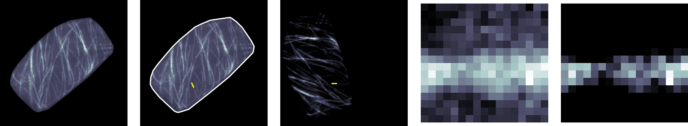

<div align = "justify">

In this post I describe a small, yet fun, analysis which might be of use to researchers in the field of microtubules. The goal is to extract estimates of the amount of polymer and  linear densities  of cortical network data from cells evolving in time such as the one below, courtesy of the [Ram Dixit lab.](https://sites.wustl.edu/dixitlab/) 

The quantities estimated here are can be used to postulate, inform, verify or constraint theoretical or computational models of cytokeletal dynamics. Such model can become quite complicated, so, with these estimations we can keep the simulations within feasible biological, physiological and mechanical limits.



  
<div style="text-align: justify"><b> <i>
Time evolution of a cortical microtubule networks in plant hypocotyl cells. This system is an example of a biological complex system out of equilibrium.</i></b>


The networks shown are flourescent microscopy images which label tubulin. As it can be seen, the filaments (microtubules) polymerise and de-polymerise at the tip.  These are anchored to the cell membrane, in the inner surface of the cell wall.

The interaction between microtubules is mechanical due to collision events. An outcome of a collision is that the tip of the <b>incoming</b>  tubule can be lost, which results in a rapid depolymerisation or <b>catastrophe</b> of the filament. Other possible scenario are that the incoming filament simply  <b>crosses</b>  over the target filament, or that the two filaments  <b>zip</b>  together forming a bundle.
 
The frequency of such outcomes, as well as geometric contraints and some other chemical and  mechanical processes determine the organisation of the network. Which can be aligned arrays, like the ones in the movie,  or disordered arrays.

For the sake of brevity, this very lousy introduction to the topic is all I am going to mention, but I really encourage you to consult a proper reference in the subject, such as [this](https://doi.org/10.1017/CBO9780511607318).

</div>

<div style =  "text-align: justify">


## Extracting the length and amount of polymer using python.

### Pre-requisites.

The main library used is [numpy](https://numpy.org/doc/stable/index.html)

[Shapely]("https://pypi.org/project/shapely/") - Very handy geometry package.

[Scikit-image]("https://scikit-image.org/") - A very well developed and supported image processing library.

I use [Pyvista]("https://docs.pyvista.org/") for the 3d renderings but as you will see, it is entirely optional.

Matplotlib and pandas for plots and data processing are also used, but by no means essential.

<div style =  "text-align: justify">

### Step 1 - Cell of interest segmentation.

We will only use the cell at the center of the movie. So the first step is to segment the region of interest across all the frames. This can be easily done by selecting a small set of points outlining the shape of the cell. This can be done using a program such as [FIJI/ImageJ]("https://imagej.net/software/fiji/downloads") or the [point picker]("https://gitlab.com/calugo/tubule-tiff-picker) GUI wrote ages ago to annotate microtubule collisions.

To form a polygon, the first and last points need to be the same. Once you have the set outlining the cell shape, and stored in a file, we need to load these in any way you prefer. Next, we load the tiff file. For this purpose I use scikit-image.
</div>

```
import skimage.io as io
import matplotlib.pyplot as plt
import numpy as np
import pyvista as pv
import pandas as pd
import glob as glob
from shapely.geometry import Polygon, Point
```
<div style="text-align: center"><b> <i>
All the modules required for this post to work.</i></b></div>


<div style="text-align: justify">

If the movie stack file is named `cortex.tiff` then to import it we invoke:
</div>

```
file = 'cortex.tiff';
Z = io.imread(file);

```

<div style="text-align: justify">
And that's that! the stack is loaded into a numpy array. By using `Z.shape`, we can obtain information about the movie. In my case `print(Z.shape)` returns the tuple `(200, 512, 512)` which tells us that there are 200 frames, each frame containing a 512x512 array image.

Once the points and the stack are loaded we can mask each frame by setting everything outside the region of interest to zero and keep the inside pixels unaltered.
</div>



  

<div style="text-align: center"><b> <i>
Step I. Region of interest segmentation. Straightforward, yet essential.</i></b></div>


<div style="text-align: justify">

The figure above shows a masked frame, this needs to be applied to every frame. This can be done as follows:

First, generate a polygon object and store all the inner points in a list.

```    
coords=[(i,j) for i,j in zip(list(X),list(Y))]
pl = Polygon(coords)
minx, miny, maxx, maxy = pl.bounds
minx, miny, maxx, maxy = int(minx), int(miny), int(maxx), int(maxy)
box_patch = [[x,y] for x in range(minx,maxx) for y in range(miny,maxy)]
pixels = []
for pb in box_patch: 
    pt = Point(pb[0],pb[1])
    if(pl.contains(pt)):
        pixels.append([int(pb[0]), int(pb[1])]) 
```

The above snippet computes all the pixels inside the `shapely` polygon object. This is of course assuming
the polygon point coordinates are stored in the arrays `X` and `Y`. Then, to  get the masked array, we apply something like the snippet below to every frame:

```
A = Z[n,:,:]
B = np.zeros(B.shape)
for pix in pixels:
        B[pix[1],pix[0]]=A[pix[1],pix[0]]

```

 

By calling `pl.area`, we get the value of the area enclosed by the polygon, which we will use later to compute the desired length and amount polymer estimates. So far, we have been using pixel units. To translate any results to actual length units, we need the scale conversion factor from the file metadata, In the present example we have \\( \lambda = 512  px / 40.96 \mu m = 12.5 \mu m ^{-1} \\). The cell area \\( A = 93731 px^2 =  600 \mu m ^ {2}\\).

An extra step that can be performed is to scale all the masked frames pixel values to take values between zero and one. I did this by applying the following function to the stack `Z`, using the list of pixels inside the polygon.

```
def scaleZ(Z,px):
    
    ZS = np.zeros(Z.shape);
    mins = []; maxs = [];
    
    for k in range(Z.shape[0]):
        for pix in px:
            ZS[k,pix[1],pix[0]] = Z[k,pix[1],pix[0]]
        
    MAX = np.max(ZS)
    ZS = ZS/MAX;
    print(ZS.shape)
    return ZS

```

</div>


### Step 2 - Background estimation and removal.

<div style="text-align: justify">


We have a stack of images showing the fluorescence signal \\( F \\) of tubulin. This means the more tubulin, the more intense the signal. If we assume that the variable of interest \\( L \\) is related to the flourescence by:  \\(\ L(r) = \alpha  F(r) + \beta \\) for every pixel \\(r\\) in the frame, we need to estimate the values of \\( \alpha \\) and \\( \beta \\). 

For the case of  \\( \beta \\), if we interpret the masked image as a surface \\( z = f(r)\\), then the level set  \\( z = c_b \\) with the largest number elements, is precisely the background. This can be found by computing the number of pixels on each level in the range of the signal as follows:

```
DATY = []; DATX = []; AVDATX = []; AVDATY = []

for q in range(Z.shape[0]):
  BA = Z[q,:,:]
  BB = BA[BA > 0]
  nx = np.unique(BB)
  ny = []
  for nj in nx:
    dyj = BB[BB == nj];
    ny.append(len(dyj))
    
  wnx = []
  wny = []
  dn = 250
  for j in range(0,len(nx)-dn):
    wnx.append(np.mean(nx[j:j+dn]))
    wny.append(np.mean(ny[j:j+dn]))
    
  AVDATX.append(wnx);
  AVDATY.append(wny);

THX=[]
    
for j in range(ZS.shape[0]):
  ymax = max(AVDATY[j])
  xj = AVDATY[j].index(ymax)
  max = AVDATX[j][xj]
  THX.append(xmax);

```

The video below illustrates what I just described for a single frame.


<b><i>Pyvista rendering of a frame as surface. (Left) full frame, (Middle) the masked frame. (Right) The signal with the background substracted.</a>
</i></b>


Applying the snippet above to every masked frame and collecting every `nx` and `ny` values, and plotting the results, we get something that looks like:


  

<b><i>(Left) Counts of the number of elements on each level set of the masked frames, for every frame. The black plots correspond to the respective smoothed signals using a sliding window, the black lines correspond to the maximum value of each smoothed plot. (Right) The smoothed signals, without the raw level set counts, alongside the set which the maximal numberf of elements (the background).</a>
</i></b>

From the plots above it es easy to set the background value as the average of values in which the plots are maximised. In this case it give a signal value of around 0.26.

We now need to calibrate the results by obtaining the value of \\( \alpha \\). 



  

<b><i>Results of removing the background in every frame (Right) versus the original data (Left).</a>
</i></b>


</div>

### Step 3 - Tubulin/Intensity ratio estimation.

<div style="text-align: justify">
This is the final step. It is a calibration step. In a nutshell, it consists of picking a segment of what appears to be a <b>single</b> microtubule segment, and measure the amount of signal per length. By doing so, we can then calculate the full amount of signal in every frame and thus make an estimation of how long does a filament need to be to accommodate that amount of signal.

The first thing to do is to navigate through the movie and select a few segments which then will be used to calibrate. This step is again a step that can be carried out using an external application to save points.



  

<b><i>Selecting a single filament by marking it allows to work on a small box around the microtubule signal. the sequence above sumarises the steps, until we have a box containing the filament with the background removed.</a>
</i></b>

If `P1 =(X1,Y1)` and `P2 = (X2,Y2)` are the coordinates, defining the segment. I chose to rotate the image around `Pa` to align the segment with the `X` axis. This is easily done using the rotate method from scikit image.

```
def Box(Zm, X, Y, dn, bkg):      
  X1=X[0]; Y1=Y[0]; X2=X[1];Y2=Y[1];
        
  if Y1 < Y2:
    Xa = X1; Xb = X2
    Ya = Y1; Yb = Y2
  else:
    Xa = X2; Xb = X1;
    Yb = Y1; Ya = Y2;
    
  Ux=Xb-Xa; Uy=Yb-Ya; R=np.sqrt(Ux**2+Uy**2)
  angle=np.arccos(Ux/R); angdeg=angle*(180/np.pi);
 
  Q = rotate(Zm,angdeg,center=(Xa,Ya),
            resize=False,preserve_range=True);

  n1=int(Xa); n2=int(Xa+R)
  m1=int(Ya)-dn; m2=int(Ya)+dn
  
  P = Q[m1:m2,n1:n2]
  Q = P - bkg;
  Q[Q<=0] = 0.0 
        
  return Q
```
<b><i>Function to compute  box  with the marked filament. The arguments are the frame `Zm`, the filament end points `X`,`Y`, the box height `dn` and the background value `bkg`. 
</i></b>

Now, that we have the box, we can systematically increase the width of the box from zero to values which contains all the signal inside. The criteria to used to select the width is the signal value in which the width starts to be almost constant. 


```
n1 = no
n2 = no+1
P = Q[n1:n2,0:Na]
dn.append(n2-n1)
In.append(sum(P.ravel()))
for n in range(no-1):
  n1 -=1
  n2 += 1          
  P = Q[n1:n2,:]
  dn.append(n2-n1)
  In.append(sum(P.ravel()))
```
<b><i>Snippet to compute the signal within a box of height `2no`. The arguments are `no` and `Na` which is the length of the box, as well as the array `Q`.
</i></b>

To determine the amount of signal in the length provided we select the point in which the signal starts to decrease by decreasing the box height. This is shown in the plots below.  


  
 
<b><i>Snippet to compute the signal within a box of height `2no`. The arguments are `no` and `Na` which is the length of the box, as well as the array `Q`.
</i></b>

By choosing several filaments across the movie, we can obtain several points and average to estimate the ratio signal/length. 



  



```
#Average of the single segments from the previous step
Sm = avth/(Q.shape[0]*Q.shape[1]) 
#Ratio pixels/length in microns
rj=512/40.96 
#Box length in microns 
dx = Lmin/rj 
#Lists to store the Amount of polymer and length
Lk = [];Ik=[]; 
Area = pl.area

#Area in microns^2
Amu = Area/(rj*rj) 
#Length of equivalent area square
DLA = np.sqrt(Amu)

for j in range(ZS.shape[0]):
    
    Zm = ZS[j,:,:] - bg
    Zm[Zm<=0] = 0.0 
    Q = Zm.ravel()
    Qa = Q[Q>=Sm]
    Qn = sum(Zm.ravel())

    Lk.append((Qn/avth)*dx)
    Ik.append(Qn/Amu)
    
    nmin =  np.min(Qa); nmax = 1
    bins = np.arange(nmin,nmax,0.005)
    yh, bn = np.histogram(Qa, bins=bins)
    
Lkav = np.mean(Lk)
SLkav = np.std(Lk)

Ikav = np.mean(Ik)
SIkav = np.std(Ik)

```

From the previous step we know that \\( L = l_o \left( \frac{I}{I_o} \right) \\). Whereas the amount of polymer is the sum of the intensity above or equal to the calibration amount \\( I_o. \\) 


Executing the snippet and collecting the mean values we get an average linear polymer length of  \\( 2293 \pm 217 \mu m \\) and the average amount of polymer per cell area \\( P_n = 7 \pm 0.7 [\mu m ]^{-2}  \\) 



  


And that's it! The full script can be found here!.

The full analyisis will probably find its way into an article, but if it is not the case, well here its to be read and maybe be used by someone interested!

</div>

### Useful tools.

<a href= "https://gitlab.com/calugo/tubule-tiff-picker">Microtubule Picker - Used in step 1 </a>

<a href= "https://imagej.net/software/fiji/downloads" >ImageJ/FIJI - Used in step 1</a>

<a href= "https://pypi.org/project/shapely/" >Shapely - Geometry package</a>


<a href = "https://scikit-image.org/">Scikit-image - General image processing library</a>