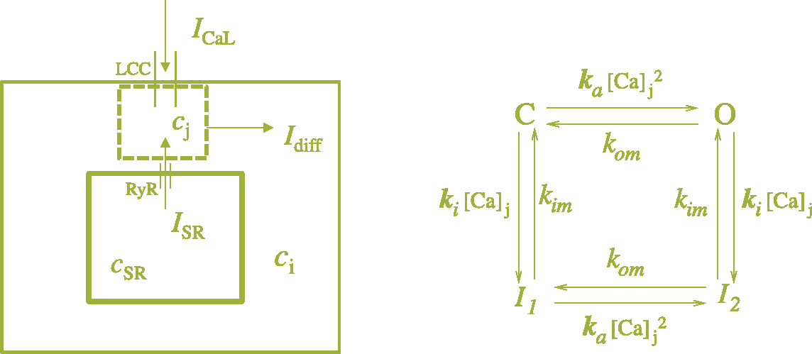

It is never easy or cheap to carry out biological research, without a laboratory, a microscope, etc. In general, practical constraints makes challenging to design practical and portable demonstrations and outreach activities to illustrate key findings and concepts.   On the other hand, using mathematical models based on physical and chemical principles allow us to formulate the theoretical frameworks which can be investigated using the machinery of dynamical systems and computer simulations, which lead to hypotheses testing, and/or predictions about the mechanisms under investigation, again, unless the target audience for a demonstration or talk is not versed with such concepts, it can be tricky to make translate any results based only on equations and static plots.

In this post, I present a set of examples which, couple experiments, maths and programming nicely in a way which can be presented to biologists, physicists and general audiences to illustrate how using in the theory, experiments alongside with computers can be used to illustrate ideas is, genetics, cardiac dynamics, neurosciences alike using a simple mechanical system. 

Again, for this project all the simulations I show here, had all the numerical codes written in C and compiled using <a href="https://emscripten.org/" target="_blank" >emscripten</a> to be used in the simulations which are all built using my favorite JS library <a href="https://threejs.org/" target = "_blank">three.js</a>.

## Excitable Systems - Shishi-odoshi.

I would like to put under consideration the oscillator illustrated below:

<iframe src="gallery/graynice.gif" style="border: 3px dotted black;width: 43%; height: 300px;"> </iframe>

Prettier versions of this device can be found in some Japanese gardens and are called "deer-frigthening" or "boar-frigthening" and according to <a href="https://en.wikipedia.org/wiki/Shishi-odoshi" target="_blank">Wikipedia</a>  that has been the traditional use of these. Beyond beauty and elegance, these devices are interesting because these show a set of features which are shared by some very important biological oscillators: 

* The system operates due to an external stimulus. 

* There exists an activation threshold, which needs to be reached before the system activates.

* There is a refractory period. Which is a time interval during which the system remains inactive even if it is under stimulation.

Known biological clocks which exhibit "similar" behaviour are cardiac cells, neurons, on a full organism scale flytraps. On each case the stimuli is electrical for the fomer two, and mechanical for the latter.

The little movie shown below (which I borrowed from  <a href="https://physics.gatech.edu/user/flavio-fenton" target="_blank">Flavio Fenton's </a> old website) shows a myocyte being stimulated at a single location.  The stimulus location releases calcium which then diffuses through the cell, activating more release locations sites and forming a wave. The stimulus is continuous, yet the behaviour of the myocyte is that of a beating cell. 

 

<iframe src="https://drive.google.com/file/d/14qzMfikBVK-uPYWsPPQ2Jc4wjAzu7AjB/preview" style="border: 3px dotted black; width: 25%; height: 100px;"> </iframe>
<b><i>Propagating calcium wave producing the contraction of a ventricular cell.  Copyright: Lee & Fenton</b></i>

## Models and Arrhythmias.

Calcium cycling in cells a very active field of research, and very <a href="https://doi.org/10.1152/ajpheart.00515.2013">detailed models</a> have been developed, incorporating experimental data and taking into account several ion currents, buffers and sequestration dynamics. These models consider cells as compartments where ion currents occur as the consequence of ions flowing from the inside of the cell to the exterior, in the case of atrial cells a common model schematic is illustrated below.

 

    
    <b><i>(A): Human atrial cell compartment model schematics  (B): The RyRs states Markov model with the four configurations O: open, C: closed, and Inactive states I1 and I2.</b></i>

The diagram above shows: (A) the way all cell compartments are represented and connected through pumps and gates, connecting several inner and outer domains of the cell. (B) The complex responsible for the calcium cycling in these type of cells are the Ryanodine receptors (RyR2)  which in this model can be found in four configurations or states   \\( (I_1, I_2, O,C) \\). The reciprocal of the transition rate  \\( \tau_r = \frac{1}{k_B} \\) corresponds to the recovery from inactivation time. 

    
    <b><i>Left: Simplified cell compartment model schematics.  Right: The RyRs states Markov model with the four configurations O: open, C: closed, and Inactive states I1 and I2.</b></i>

The translation of the dynamics sketched in the diagrams into mathematical models can be as complex and detailed as we require (see [1]). In this post however I would like to use the model presented in [2], which serves very well to illustrate what we want in this post.

$$\dot{c}\_{j} = I_{s}(t)+g_{rel}c_{rel}\frac{k_ac_j^2}{k_{om}+k_ac_j^2}(c_{SR}-c_j) - (c_j-c_o)/\tau_{diff}\quad(1)$$

$$\dot{c}\_{rel} = k_{im}(1-c_{rel}) - k_ic_jc_{rel}\quad(2)$$

(1) and (2) constitute a minimal model for calcium release incorporating the release dynamics. Notice that the first term in (1)'s rhs is the external stimulus \\(I_{CaL}(t)=I_{s}(t)\\), Which is provided by the pacemaker cells in the heart or externally in experiments. These cells provide a periodic stimulus \\(T_s\\). This is where things get interesting. 

A healthy cell will normally release Calcium periodically, driven by the stimulus if the recovery time of the ion release channels is slower compared to the stimulus. An example is illustrated below.  Where \\(T_s=400\ ms\\) and \\(T_r = 200\ ms \\) 

<iframe  src="https://calugo.github.io/UPC_Minimal_Calcium_Model/NALTT400.html" style="border: 0px dotted black; width: 60%; height: 850px;"> </iframe>
<b><i>
</i></b>

### RyR2 malfunctions, Alternans and the origin of Fibrillation.  

If on the other hand the release is slower due to a malfunction of the calcium release units, which might lead to a slow recovery, the periodic response alternates between a high/low beat to beat calcium release regime. These  <b><i>calcium alternans</b></i> are a known mechanism for inducing cardiac arrhythmias such as atrial fibrillation.  Below I show results for the case of 
 \\( T_s=400\ ms \\) and \\(T_r = 320\ ms \\) .

<iframe  src="https://calugo.github.io/UPC_Minimal_Calcium_Model/ALTT400.html" style="border: 0px dotted black; width: 60%; height: 850px;"> </iframe>
<b><i>
</i></b>

## Stimulus-Recovery relationship and Interactive Solver.

By collecting the maxima of the solutions, and sweeping the recovery times, keeping the stimulus period fixed, we can generate a bifurcation diagram containing the recovery time values for which the system exhibit regular oscillation as well as the values for which the alternating regime occurs.

    
    <b><i>Bifurcation plot: Maximum amplitudes of Cj  vs &tau;rec  It can be seen which intervals present regular oscillations, 2:1 alternans as well as 3:1 alternans.</b></i>

If you want to play around this model, next I present an interactive solver-plotter where you can change the values of the stimulus and the recovery time!

 

 <iframe src="https://calugo.github.io/UPC_Minimal_Calcium_Model/"
 style="border: 3px dotted black; width: 100%; height: 300px;"> </iframe>
<b><i>Interactive Numerical integrator of Eqns. (1) - (2). It works better on a <a href="https://calugo.github.io/UPC_Minimal_Calcium_Model/"  target="_blank">tab of its own!</a>. 
C, Python and Julia versions, instructions and documentation to make your own can be found <a href="https://github.com/calugo/UPC_Minimal_Calcium_Model">in this repository</a>. The solution scene can be panned around and zoomed in/out using the mouse's right and middle buttons (or the touch gestures, equivalents).
</i></b>

 

## Back to the seesaw

The complex alternating behaviour of the cardiac cells occurs if the cell possess dysfunctional calcium release units due to a damaged cell, or an underlying genetic condition. Mathematically this is encoded in the value of \\( k_{im} \\). 

To investigate the origin of these dynamics, it is easy to build a japanese seesaw with bits and bobs of Lego and K'Nex sets (The best ever construction set available? Certainly the most versatile!). And make the following observations about the system 
parameters.

 

The seesaw can be presented as a composite of three bodies. A rod of length \( l \) and mass \(m_b\), a mass \(m_1\) attached to one end of the rod, and a second mass \(m_2\) attached to the other end. If
 the rod is allowed to rotate through an axis passing across its center of mass, then we can consider the system as a rigid body with moment of inertia \( I=I_b+l^2(m_1 +m_2)/4 \).  Where \(I_b\) is the moment
 of inertia of the bar. If the bar is a cylindrical rod of uniform mass density, then \( I_b = l^2/12\). Balancing the torques is easy to obtain the equation of motion for the angle \(\Phi\):

$$I\ddot{\Phi}=- \frac{gl}{2}\sin\Phi$$
Or:
$$\ddot{\Phi}=-\frac{g}{l}\frac{m_1-m_2}{m_b+3(m_1-m_2)}\sin\Phi\quad(3)$$

 

Before invetigating Eq. (3) numerically further approximations and boundary conditions should be provided. In this case, the conditions to constrain the angle between \(\Phi_1 = 2\pi-\arcsin(2h_1/l) \) and \(\Phi_2=\arcsin(2h_2/l) \).

Alongside these condition we need to incorporate the stimulus, in this case by adding mass to the mass attached in the right end of the rod. A very easy way to do this is to use the conditions:

$$m_2=m_{2o} + \alpha t$$

If the angle \\(\Phi \geq \Phi^{\dagger} \\). Where \\(\Phi^{{\dagger}}\\) is a parameter stating the range of action if the stimulus. And the condition \\( m_2(t\') = \gamma m_2(t) \\) if \\( \Phi = \Phi_2\\). Where 
\\(\gamma \in [0,1] \\) is a parameter stating the fraction of water released if we reached the boundary condition at \\( \Phi_2 \\). This parameter is the analogous to the parameter \\( k_{im}\\), As it regulates the recovery time.

We can see that there are a few parameters which are important, for instance the threshold mass \\(m_1 \\) which needs to be surpassed by \\(m_2\\) to move the centre of mass from the quadrant satisfying the constraint 
\\(\Phi_1\\) into motion. Another two important parameters are the current \\(\alpha\\) as well as the fraction of water released mentioned above. We will return to this at the end of the post. For now, let us see the system 
in action!

 

# Experiments.

I built a small portable seesaw. The images below show the device. I used the building toy Knex and Lego pieces, and some makerbeam frame and brack pieces for this. Although I had made versions with knex and 
Lego parts (see the gif in the projects menu). The important parts of the toy are shown in the third and fourth images, which are what can be labeled as wildtype and the mutants, to make an analogy
with biological concepts. In the sense that these parts can be modified in a modular way and plugged in to the mechanism, just as we do in some gene regulatory networks. The mutants 
basically consist of release mechanisms which loss water, faster or slower depending on the position and number of holes in the recipient.  

 

I



<b><i>The Japanese seesaw toy: (Left and Middle left) The device. (Middle Right and Right) The replaceable release mechanism: by using different configurations we can modify the release
of fluid, therefore the refractory period.
</i></b>

A movie of the system is action is shown below:

 <iframe  src="https://drive.google.com/file/d/1b96Zlulq5N_p-HcVhIu5cXPPeIY7bwL6/preview" style="border: 3px dotted black; width: 50%; height: 300px;"> </iframe>
<b><i>The seesaw in action! This is the periodic behaviour we can expect, if the release in almost complete and the refiill is not very fast, so the system fully recovers its initial position.
</i></b>

From the videos, it is straightforward to extract the angle using simple segmentation methods (I used OpenCV to segment the yellow bar). As illustrated in the animation below:

 <iframe  src="gallery/WTHTOP.gif" style="border: 3px dotted black; width: 99%; height: 400px;"> </iframe>
<b><i>The seesaw in action! This is the WT expected periodic behaviour if the release in almost total and the refill is not very fast, allowing full recovery.
</i></b>

## Inducing alternans.

Using one of the mutant release units, we observe the  following dynamics:

 <iframe  src="gallery/new2H_joy.gif" style="border: 3px dotted black; width: 99%; height: 400px;"> </iframe>
<b><i>By replacing the release unit, we observe the 2:1 alternating behaviour. The release unit in this case releases a different amount of water (its the two holed mutant shown above).</i></b>

Although it quite easy to carry out these type of experiments, It quickly becomes rather complicated to measure a full set of initial conditions and parameter values. For instance to have a cheap and on the fly way to measure the water flow, or to automate the process of water recycling over many tries becomes pretty complicated if we are running the experiments on a near to zero budget. This makes simulation a great tool to use.  

## Simulations.

Numerical integration of Eq. (3) using the value of \(  g = 9.81\, m/s^2\), the masses of the order of grams and the length of the order of centimeters can be carried easily. Below I show a numerical integrator written in C and compiled with emscripten (WASM). The codes and details can be found <a href="https://github.com/calugo/Shishi_Odoshi_Mechanical_Neuron" target=_blank>here</a>. The default parameters are chosen to exhibit alternating dynamics. By modifying \(k_m \) is easy to recover the periodic behaviour.

<iframe  src="https://calugo.github.io/Shishi_Odoshi_Mechanical_Neuron/" style="border: 0px dotted black; width: 80%; height: 850px;"> </iframe>
<b><i>
Interactive simulator: The tunable parameters are H: Red bar position, H2: Blue bar position, Xo: Stimulus angle range (white line), km: Fraction of water released, Is: current strength. The plots displayed are the mass present at the right end of the seesaw \( \Delta m (t) \) as well as the angle temporal evolution \( \Phi(t) \). Once a solution is computed the PLAY button shows the rod oscillation simulation.
</i></b>

Playing around with the integrator, We can always find solutions which resemble the experiments. In the case of the recovery from inactivation, it is notable that the mechanism translates in a straightforward way! 

I have used this small system to connect introduce concepts in genetics, synthetic biology, differential equations, computational physics and recently in physics informed machine learning to audiences of a very varied nature, and thought It would be nice to have it more or less documented in an organised and interactive way accessible for future use.

This is the first out of two entries in the series, the other one linking chemical reactions and electronic circuits.

# References.

1. *Are SR Ca content fluctuations or SR refractoriness the key to atrial cardiac alternans?: insights from a human atrial model.-*
[AJP. Heart and Circulatory Physiology.](https://doi.org/10.1152/ajpheart.00515.2013)
2. *Minimal model for calcium alternans due to SR release refractoriness.-*
[Chaos.](https://doi.org/10.1063/1.5000709)

