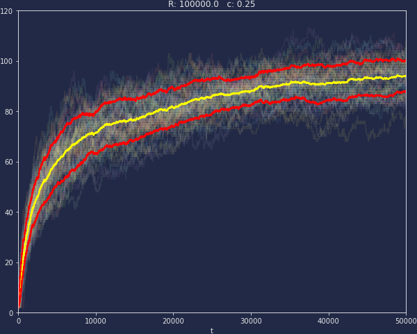
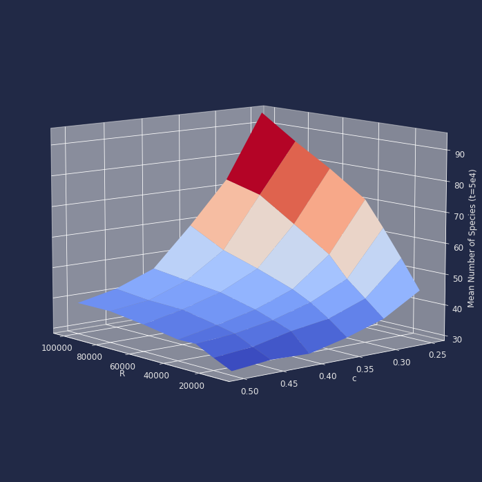

The surge of technologies like  <a href="https://webassembly.org/" target = "_blank">
WebAssembly</a>
 and its associated ecosystem <a href="https://emscripten.org/index.html" target ="_blank">ecmscripten</a>
 ,  <a href="https://docs.pyscript.net/2025.3.1/" target="_blank">pyscript</a>  and  <a href="https://panel.holoviz.org/index.html" target="_blank">panel</a>, allow the development of web content in languages like C, Go, Julia or Python, which can be executed on almost any modern web-browser.  This provided me with an excellent justification to revise some interesting models and simulations close to my heart, and which can be used to produce demos I can put on spaces like this website.

An example, very much of interest today, not only to me but to several people in the ecology and evolution communities is the formation, co-evolution and resilience
 of ecological networks. In this post I briefly present a very popular model of evolutionary dynamics, the <b>web world</b> model, and present a <b>python</b> implementation
 of it, which I also embed on the page. 
 
The advantage of being able to share codes in repositories for anybody to run their own simulations, is now 
enhanced with the ability to literally execute the same code in the browser! This allows anybody to get a flavour of 
the dynamics without having to install and download anything.

## Foodwebs and ecological evolution.

Before discussing the main features of the <b>webworld model</b>. Let me introduce the concept of <b>foodweb</b>.  
  In a nutshell, foodwebs are the network-like hierarchical structures which result of quantifying <b>which species eats which species</b> in a given ecosystem.

 
 
 

<iframe src="https://calugo.github.io/WebWorld/fweb"
 style="height:690px;width:800px;" title="Iframe Example"></iframe>
 
<b> <i>
Typical foodweb evolution obtained with webworld. Each node represents a species, 
the node radius is equal to the logarithm of the population and the width of the 
links is equal to the strength of the interaction. We start with a single species, 
and continue to show the network as the system evolves by adding more species. 
The arrows point in the direction of the flow of resources. 
At the very beginning of the evolution, the only species present feeds from the external resources.
</i></b>

 

A <b>foodweb</b> is constructed by considering all the species present in an ecosystem and quantifying all the predators and prey of 
each species. If a species does not posses any prey, but the external resources, then it belongs to the  <b>basal trophic level</b>. 
If on the contrary, a species does not have any predators, only prey, then it belongs to the <b>top trophic level</b>. 
Species predator and prey species are accommodated in a <b>trophic level</b> computed by the shortest path to the external resources. 
In general, foodwebs only have a few of trophic levels and the population sizes of basal species are often orders of magnitude larger
 that those is the intermediate and upper levels.

## The webworld model - evolution as a complex system.

A very important aspect of modelling natural phenomena consists of linking the set of equations and core ideas with some representation of the solutions, like a plot or a movie of showing the dynamical behaviour of the system, which is not an easy task itself. Specially, If the system under study is operates in several time-scales in space and time, and it is composed with many different interacting elements. 

<b>Complex systems</b>, are those in  which their components interact locally amongst them according to some set of rules and are unaware of any global pattern emerging from those interactions. For instance, in an ecosystem, species interact by predator/prey relationships. Some species prey on other species, and at the same time are eaten by some predator species, alongside those processes, species also produce offspring an die of natural causes with some seasonal rate, thus, modifying the species population. The population update processes, might lead to patterns, such as oscillatory behaviours, stable co-existence and extinctions, events which occur at the ecosystem level, well beyond the level of the events of eating and being eaten.

These seasonal population updates occur in the time scale of months/years and in general we can write a model as follows.   

$$\dot{N_i}(t)=\lambda \sum_j g_{ij}(t)N_i(t) - \sum_j g_{ji}(t)N_j(t)-d_iN_i(t) \quad (1)$$

The parameters \\( \lambda\\) and \\(d_i\\) correspond to the efficiency at which the resources transfer from a prey to its predator, and the natural death rates.

To complete such a model we need to specify the predation rates \\(g_{kl}(t) \\) between species \\( k \\) and \\( l \\).  However, the goal here is more ambitious, we want to know, how does 
an ecosystem is formed in the first place! As well as how does <b>natural selection</b> drives the system to robust and stable configurations, in which the system \\( (1) \\) operates. 

To do so, we might, first consider a starting ecosystem consisting of a single species and establish the criteria for species evolution, and how to determine if two species posses a predator/prey relationship.

### Species features and mutations.

Species are defined by a set of <b>phenotypical features.</b> This is a set of \(L \) different integers \( f_i=\{n_j\}_{j=1}^L \) taken from a pool of \( K \) possible values. Each of the features is compared against each other by a score encoded in a anti-symmetric \( K\times K \) matrix \(\bf{M}\) which contains a random number. Then if we consider two species \( i,j \).  We score them by computing:

$$S_{ij} = \max \lbrace 0,\frac{1}{L}\sum_{a \in i, \thinspace b \in j} M_{a,b}\rbrace \quad(2)$$

Which allow us to determine if there exists a predator prey relationship between \\( i \\) and \\( j\\). With this definition of species and species score \\( (2) \\) we can treat the external resources as species \\( "0" \\), with a string fixed and a large population value \\( R \\).

### Choice of diet, rates and evolutionarily stable strategies.

Once that we have a definition of species and a way to compare them. We can assume that species which are close in terms of features and posses a common prey compete harder for a common prey between them, in comparison with species which are not very similar. In fact, inter-specific competition will be the hardest. To achieve this, the model defines the competition score between species \(i\) and \(j\)  as: 

$$\alpha_{ij} = c+(1-c)q_{ij}\quad(3)$$
 
 Where \\(c \in (0,1)\\) is a competition parameter and \\(q_{ij}\\) is the fraction of common features between species.

For the rates \\( g_{ij}(t) \\) the model uses the generalised ratio dependent functional response:

$$g_{ij} = \frac{ f_{ij}S_{ij}N_j }{bNj + \sum_{k} \alpha_{ki}f_{kj}S_kjN_k} \quad(4)$$

This choice \\( (4) \\) introduces the fractions of effort \\( f_{ij} \\) a species \\( i \\) puts into foraging for \\(j \\).  In other words:

$$ f_{ij} = \frac{g_{ij}}{\sum_j g_{ij}} \quad(5)$$

Equations \\( (4) \\) and \\( (5) \\) are re-adjusted each time the populations change. These, determine the foraging strategy of the each predator. This choice of efforts is an evolutionary stable strategy (ESS), which means that any other strategy can not be successful against it, provided the ESS is already taken by the majority. The dynamics of the efforts takes place in the shorter time scale of the model, which is that of hours/days. 


  

<b> <i>
Evolution of the system in between evolutionary steps, showing the population updates and the adjustment of the efforts (links thickness). 
In this particular set, we can also observe an extinction event, which is determined once a population reaches a value below 1.
</i></b>

For a fixed set of species, the foraging and population dynamics will eventually lead to a stationary state, where nothing will 
change any further. Once such a fixed point is reached, a new species is added to the system. New species are introduced, by choosing
 any of the surviving species and replacing one of the features for a new one (evolutionary step). 
 The new species starts with a population of one individual and the short and intermediate time scale dynamics starts again.

 
<iframe src="https://calugo.github.io/WebWorld/joy"
 style= "width: 100%; height:470px;  title="Iframe Example"></iframe>

<b> <i>
Evolution of the number of species (right panel) and the efforts matrix (left panel) corresponding to the foodwebs shown earlier. Notice that the system starts with one species and then it fluctuates by the action of extinction events and evolutionary events. 
</i></b>

 
 

# Code repositories.

If you want to play with this model in your own computer, or have an issue, there is a github repository available <a href="https://github.com/calugo/WebWorld">here</a>

For the live version of the code, the hugginface model space lives <a href="https://huggingface.co/spaces/kupkasmale/WebWorld"> here </a> and its embedded below!

## Live Version.
 <iframe
	src="https://kupkasmale-webworld.hf.space"
	frameborder="0"
	style = "width: 100%; height: 450px"
></iframe>

<b> <i>
This is it! Run the model right here, right now!. Press the run button and you will see the number of species updating every few hundred evolutionary events (species introduction). This will run until the system performs 5000 evolutionary time-steps or it reaches 59 species. Once the simulation is completed you can see a diagram of the foodweb in the tab labeled <b>PlotFW</b>. The diagram in the live version is drawn with <b>networkx</b> instead of matplotlib, such as the ones provided in the 
 <a href="https://github.com/calugo/WebWorld">github</a> repository, and shown in this post. Please be sure you also visit the
 <a href="https://huggingface.co/spaces/kupkasmale/WebWorld"> hugginface </a> repository to run this on a full screen!
</i></b>

Below I show a couple of plots which illustrate some of the trends produced by the model. First the number of species in  the system for 50 realisations as a functionalof 
time, measured in speciation events (evolutionary time-scale) and the average value (yellow line) with the standard deviation (red lines). This figure shows simulations for
\\( 5\times10^4 \\) time steps and parameter values \\( R=1\times10^4 \\) and \\( c=0.25 \\).


  


Next, I show the mean number of species at \\(t= 5 \times10^4\\) for different values of \\(R \\) and \\( c \\). We can see that low resources and high competition limit the system size.


  


## Suggested readings for in-depth details and discussion of the model and results.

 
 For a thorough discussion on the theory of ecological communities, details in the implementation of webworld and other evolutionary approaches, please check the papers and references in the following list:

1. *Modelling coevolution in multispecies communities*
[J. Theor. Biol.](https://doi.org/10.1006/jtbi.1998.0706)

2. *The influence of predator–prey population dynamics on the long-term evolution of food web structure*
[J. Theor. Biol.](https://doi.org/10.1006/jtbi.2000.2203)
3. *The impact of nonlinear functional responses on the long-term evolution of food web structure.*
[J. Theor. Biol.](https://doi.org/10.1016/j.jtbi.2004.04.033)
4. *Modelling food webs* [
    Handbook of Graphs and Networks: From the Genome to the Internet](https://doi.org/10.1002/3527602755.ch10)
5. *Topological structure and interaction strengths in model food webs.*
[Ecol. Model.](https://doi.org/10.1016/j.ecolmodel.2004.12.018)
6. *The robustness of the Webworld model to changes in its structure.*
[Ecological Complexity](https://doi.org/10.1016/j.ecocom.2007.06.012)

7. *The characteristics of species in an evolutionary food web model*
[J. Theor. Biol.](https://doi.org/10.1016/j.jtbi.2008.02.028)